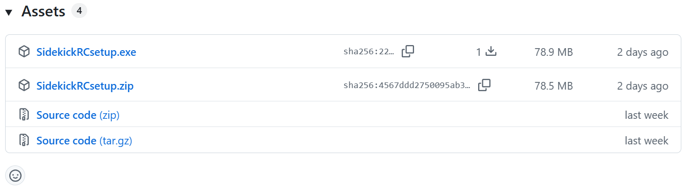
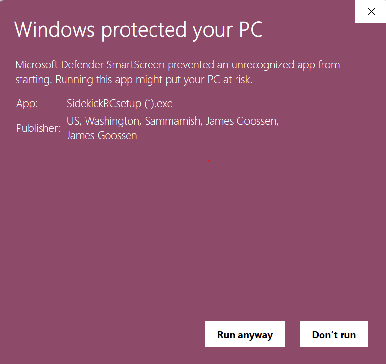
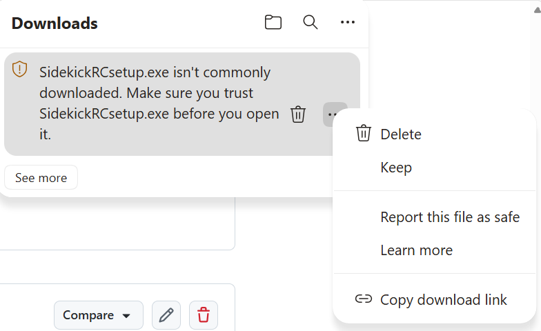
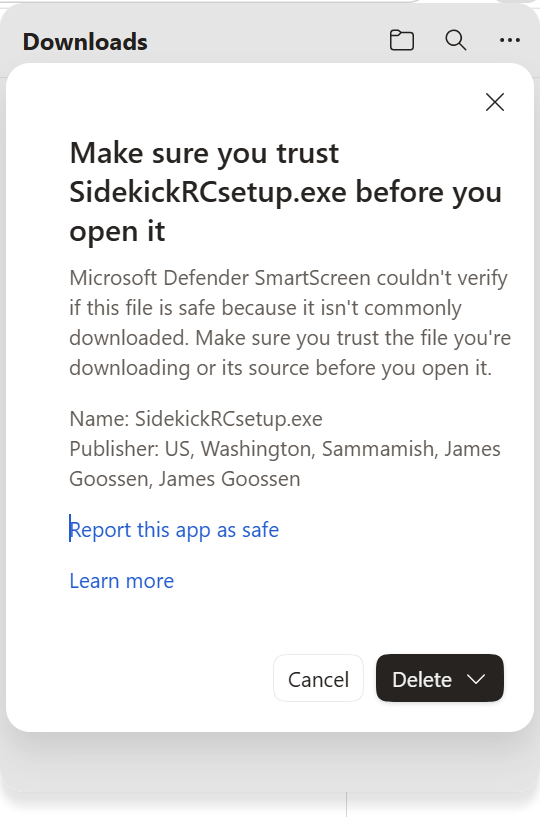
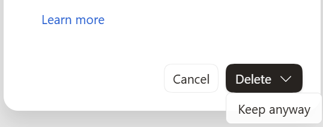

# Installation
Here we detail how to install the two components of **Sidekick**: the library and the PC application.

## 1. Install the Library (If Someone on Your Team Hasn't Already)
Go to the [Loonybot GitHub SidekickRC releases](https://github.com/Loonybot/SidekickRC/releases) page and find the newest version labeled "Sidekick RC Library". Follow the installation instructions there. 

If you had a minimal **build.gradle**, your resulting file should look like the following, with the changes highlighted. 
Your configuration may have many additional lines, but these lines should all be present.

```groovy title="Changes for a minimal build.gradle" hl_lines="14-16 20"
apply plugin: 'com.android.application'

apply from: '../build.common.gradle'
apply from: '../build.dependencies.gradle'

android {
    namespace = 'org.firstinspires.ftc.teamcode'

    packagingOptions {
        jniLibs.useLegacyPackaging true
    }
}

repositories {
    maven { url 'https://jitpack.io' }
}

dependencies {
    implementation project(':FtcRobotController')
    implementation 'com.github.Loonybot:SidekickRC:lib-v??.??.??'
}
```

Note that you shouldn't actually see `v??.??.??` in your **build.gradle** file because you'll have used the version number of the latest library released on [GitHub](https://github.com/Loonybot/SidekickRC/releases).

Once you're done modifying **build.gradle**, don't forget to sync your project with the updated Gradle file by pressing the Elephant icon in the top-right corner of Android Studio.

## 2. Install the Application on Your PC
If you have a Windows PC, go to the [Loonybot GitHub SidekickRC releases](https://github.com/Loonybot/SidekickRC/releases) page and find the newest version labeled "Sidekick RC application". Click `SidekickRCsetup.exe` under "Assets" to install Sidekick RC for Windows.

If you have a Mac PC, sorry, you'll have to wait until we port.

!!!note
    When you're looking for the install package on GitHub, the Assets tab may be collapsed:

    {width="150"}

    Click the "Assets" text to expand it:

    

Because the **Sidekick** application is new, Windows Defender may flag it as an unrecognized app when you run SidekickRCsetup.exe. If you see a "Windows protected your PC" dialog, click on the "**More Info**" button and verify that the publisher is James Goossen in Sammamish (that's me!). If it is, press "**Run anyway**" to install. Once enough people have installed Sidekick, Defender will start recognizing it and the warning will no longer appear.

{width="300"}

!!!note 
    If you use Microsoft Edge as your browser and it says "SidekickRCsetup.exe isn't commonly downloaded", you'll have additional steps to take. Click `⋯` to the right of that message and then select "Keep".

    {width="400"}

    Then you'll likely see _another_ dialog:

    {width="300"}

    Click on the down-arrow portion of "Delete" to reveal another option:

    {width="300"}

    Select "Keep anyway" and then it should install.


## Verify Your Install
Once you've installed the **Sidekick** application and are running robot code that includes the **Sidekick** library, connect to the robot. 
(Use the `Connect` button in the app if you're not already Wi-Fi connected.) 
If everything is working correctly, you should see a green "Connected" status for "Sidekick" in the status bar at the bottom-right edge of the window. 
Congratulations, Sidekick is enabled and working on your robot!

If you don't see "Connected" for either "Wi-Fi" or "Sidekick", that means that your PC is not connected to the robot. Try pressing the `Connect` button to establish a Wi-Fi connection.

If you see "Connected" for "Wi-Fi" but not for "Sidekick", then the library is not properly installed or not enabled on the robot. 
Verify that you synced with the updated Gradle file via the Elephant icon, that your code built properly, and that you were able to successfully deploy the updated code to the robot.
